记账本软件实现了验证码登录，用QQ邮箱验证码注册和找回密码，更换头像，添加、查询、删除支出和收入记录，统计支出账单和收入账单，统计共计收入，数据表格上一页切换，下一页切换，指定页面切换，退出登录，注销用户，导出Excel功能。

创建数据库
CREATE DATABASE BookkeepingDB;

USE BookkeepingDB;

CREATE TABLE RecordInfo(
    UserID BIGINT NOT NULL,
    BillType VARCHAR(50) NOT NULL,
    InOrOut NCHAR(10) NOT NULL,
    Money float NOT NULL,
    Remark NCHAR(500),
    RecordTime DATE NOT NULL
);

CREATE TABLE UserInfo(
    UserID BIGINT NOT NULL PRIMARY KEY,
    UserName NCHAR(30) NOT NULL,
    UserPassword VARCHAR(50) NOT NULL,
    UserMail NCHAR(30) NOT NULL,
    UserPhoto IMAGE
);

发件人邮箱和邮箱授权码写自己的
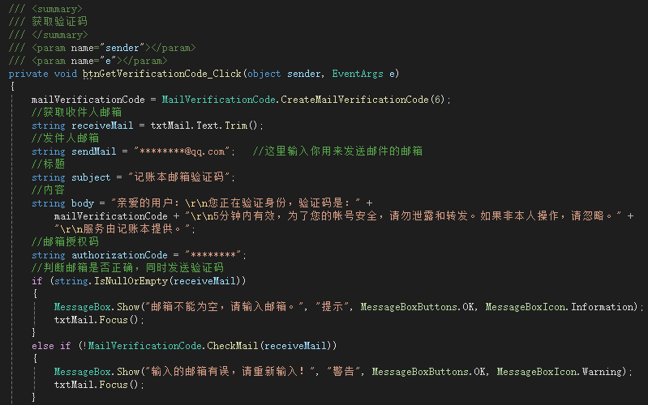

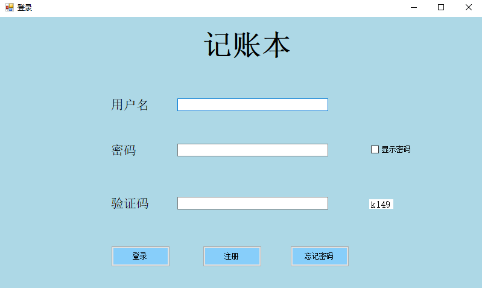

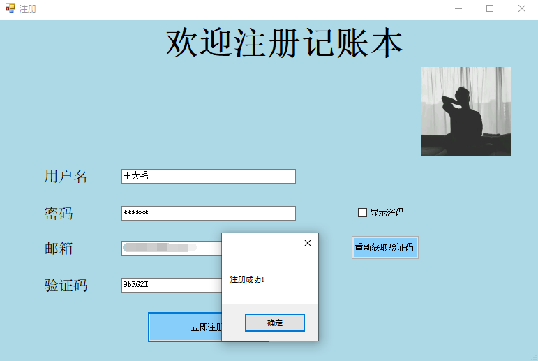

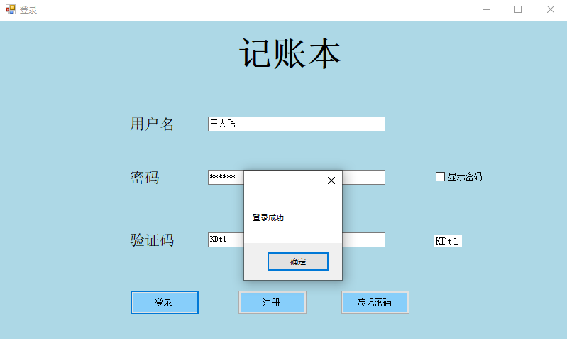

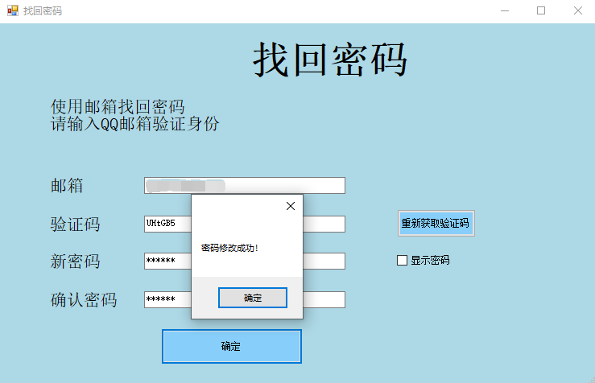

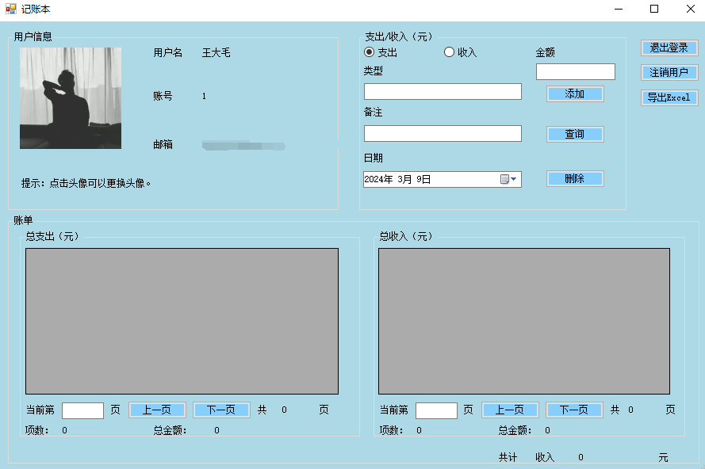

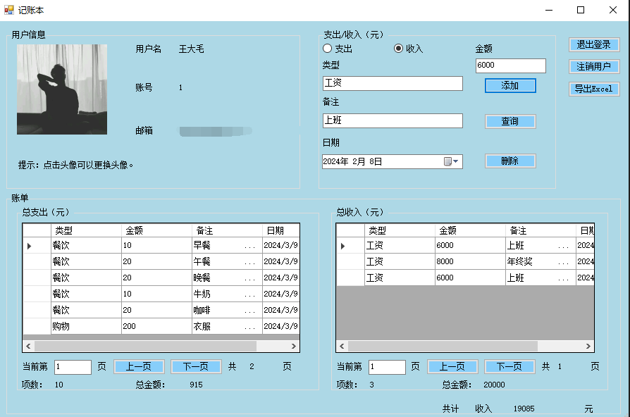

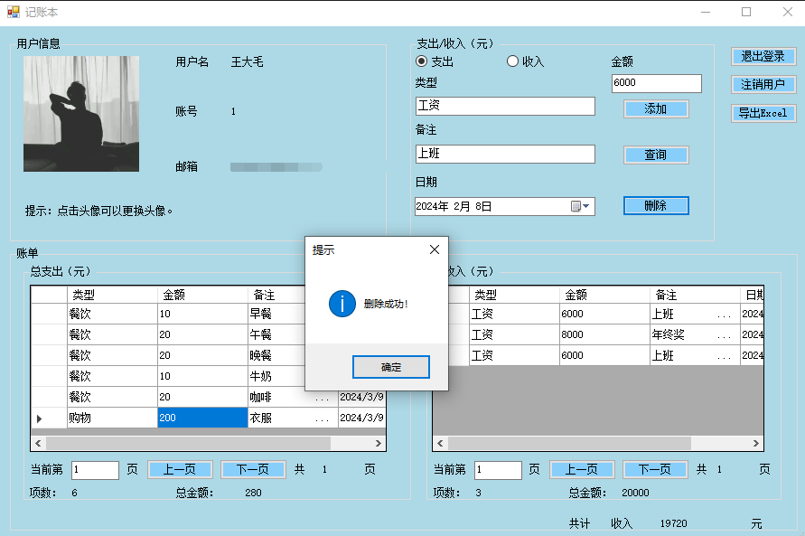

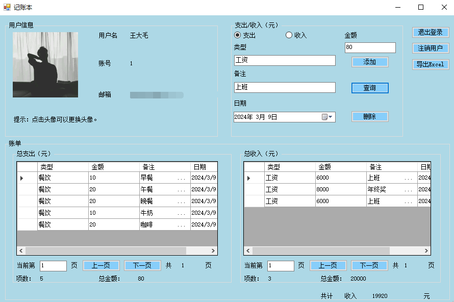

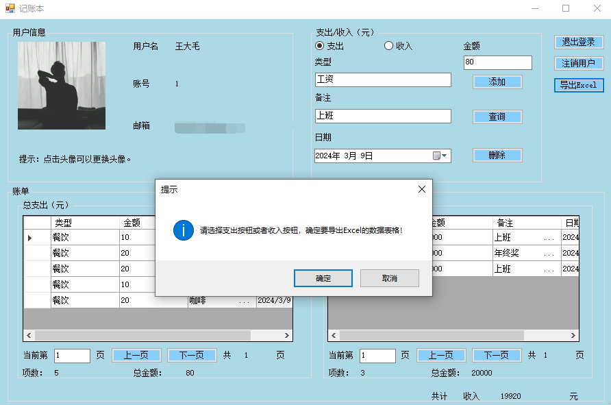

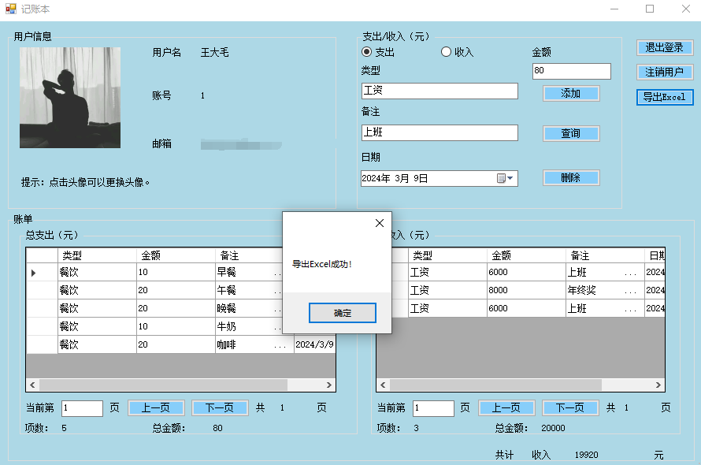

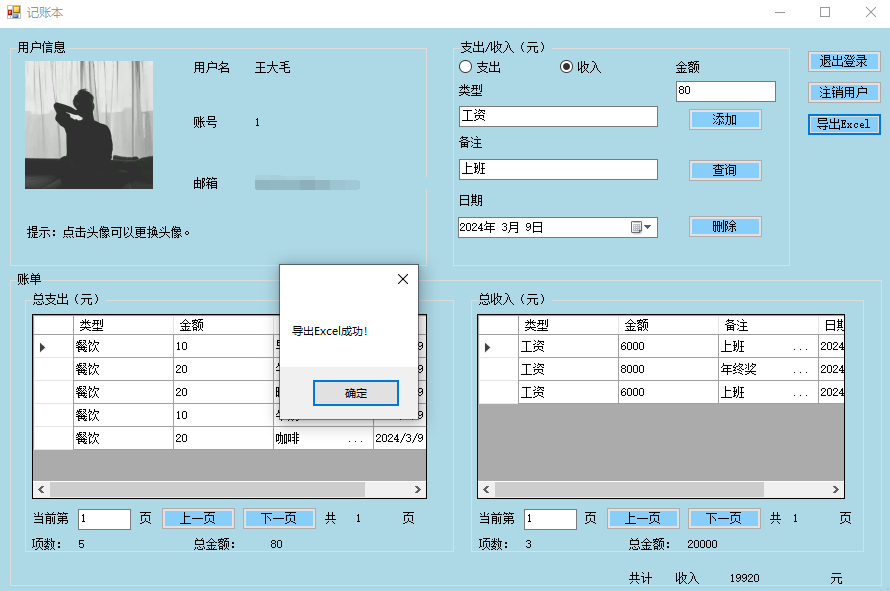

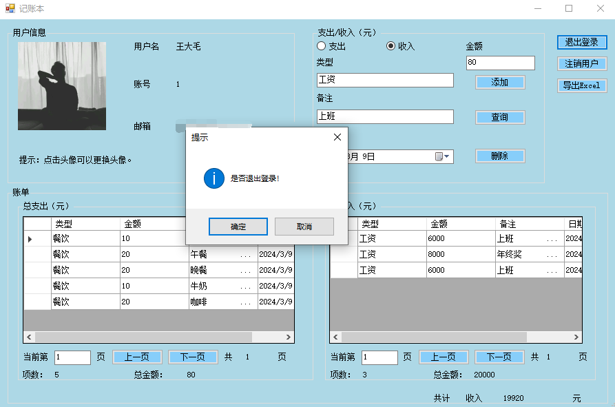

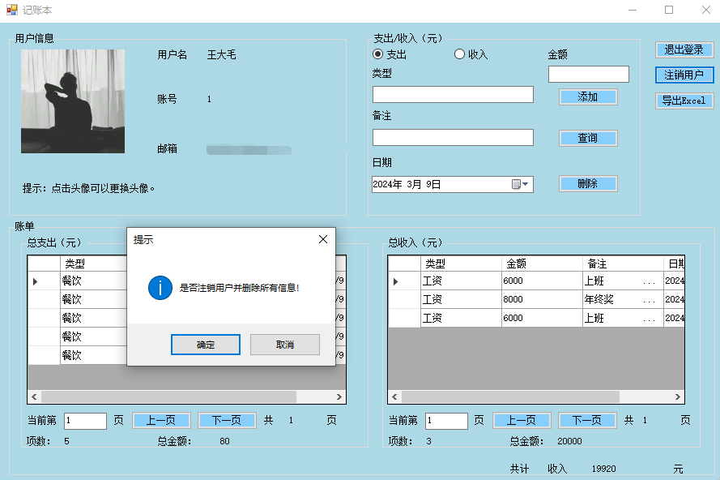

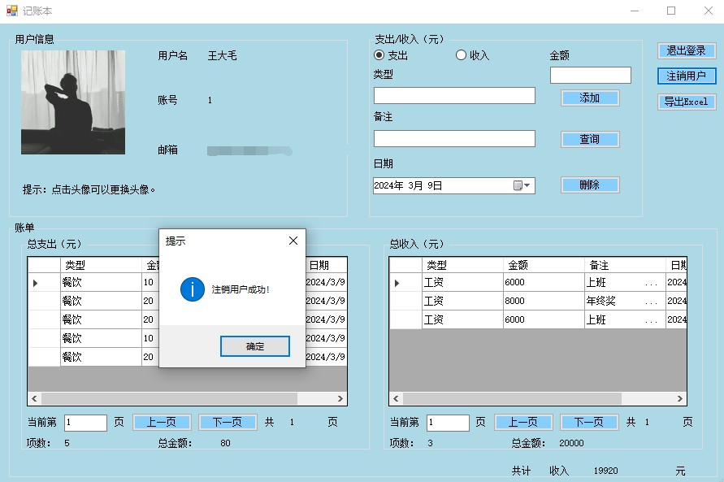